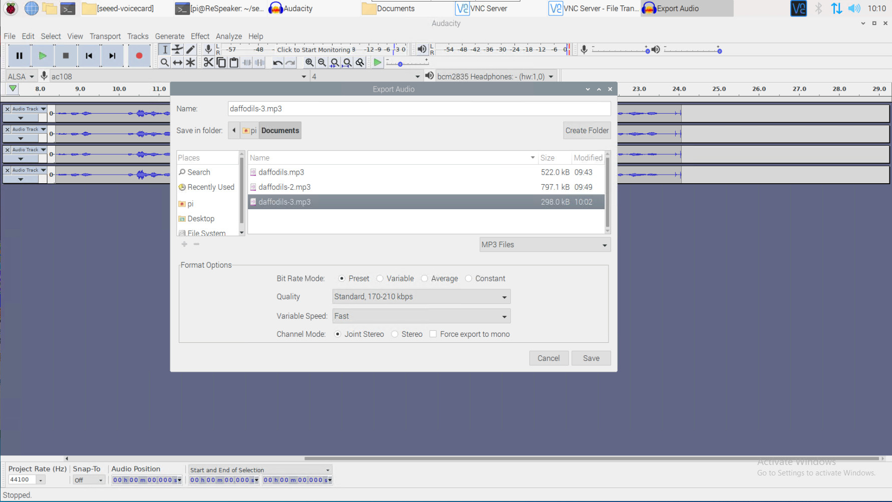

# Lab 1: Install Raspbian OS and Driver

## 1. Prerequisites:

- Raspberry Pi 3B/4B, 1GB+ RAM, 16GB+ SD card
- ReSpeaker 4-Mic Array

  

- SD card reader - USB interface
- Raspberry Pi OS Imager

---

## 2. Download Raspbian OS

Download the latest Raspbian OS **Buster 32-bit** from official website.
https://downloads.raspberrypi.org/raspios_armhf/images/raspios_armhf-2021-05-28/
	
Use the `Raspberry Pi OS Imager` to flash the OS to the SD card.

Once it's successfully written and verified, you may remove the SD card and insert it into your Raspberry Pi.

In this series of labs, I will be using a Raspberry Pi 4B, and will use RPi to refer to Raspberry Pi afterwards.

---

## 3. Boot up and configure the RPi

You may use `Raspsberry Pi Software Configuration Tool` tool to configure your RPi. It's a powerful tool which can be run in command line mode and provides a straightforward way of doing initial configuration of the Raspberry Pi. 

`$ sudo raspi-config`

  

### 3.1 Change password and hostname

Go to `1 System Options` -> `S3 Password` -> `S4 Hostname`. 

I changed my RPi hostname to `ReSpeaker`.

### 3.2 Select audio output

Go to `1 System Options` -> `S2 Audio` -> Choose the audio output: `1 Headphones`.

### 3.3 Change interface

Enable SSH, VNC, SPI and I2C.
Go to `3 Interface Options` -> `P2 SSH` -> `P3 VNC` -> `P4 SPI` -> `P5 I2C`.

You may also enable other features, but that's what we need for now.

---

## 4. Install driver

### 4.1 Download the Seeed voice card source code, install and reboot.

```
sudo apt-get update
git clone https://github.com/Seeed-Projects/seeed-voicecard.git
cd seeed-voicecard
sudo ./install.sh
sudo reboot now
```


### 4.2 Select audio output on RPi

Run below command:
```
sudo raspi-config
```
You may select preferred audio output: `0 - HDMI`, `1 - Headphones`.


In this lab, I will use Headphones as the audio output.

### 4.3 Verify the sound card name

Run below command to check teh sound card name.

```
arecord -L
```


## 5. Install and run Audacity on RPi

### 5.1 Install Audacity
```
sudo apt update
sudo apt install audacity
```


### 5.2 Run Audacity app

Run Audacity app from bash or from GUI:

- Run below command from Bash:
```
audacity
```

- Run from GUI:

`Raspberry Pi logo` -> `Sound & Video` -> `Audacity`.


The Audacity app UI is like this:


### 5.3 Record an audio

Select or `ac108` and `4` channels as audio input and `bcm2835 Headphones-(hw:1,0)` as audio output.


Click `Record button` to start the recording. 


### 5.4 Export the audio to a .mp3 file

Click `File` -> `Export` -> `Export as MP3`.




This exported `.mp3` file can be played anywhere like Windows.

`<END of Lab1>`