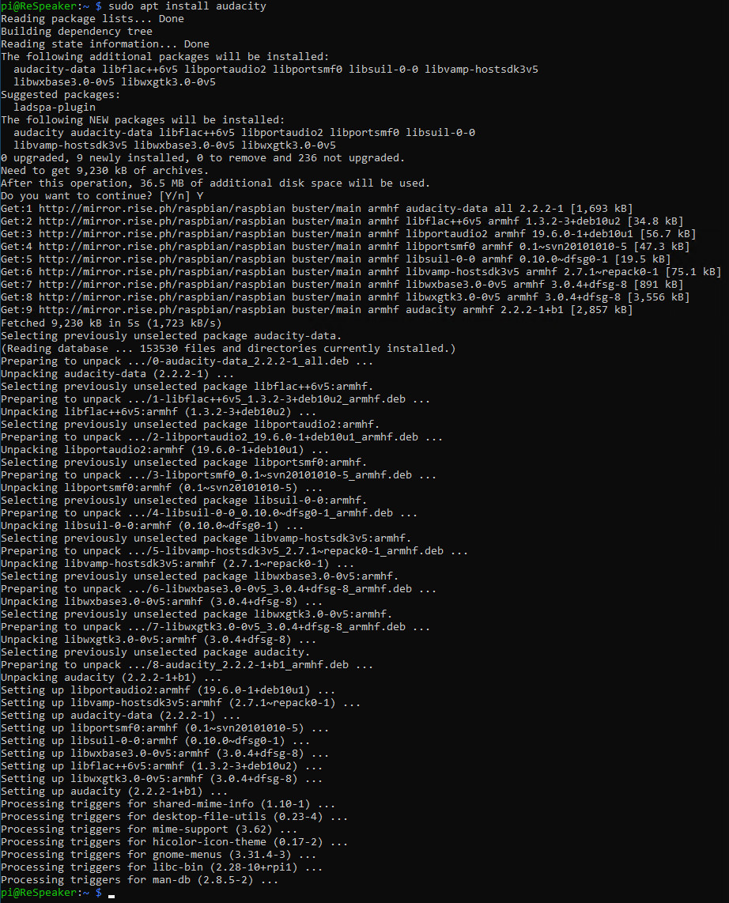
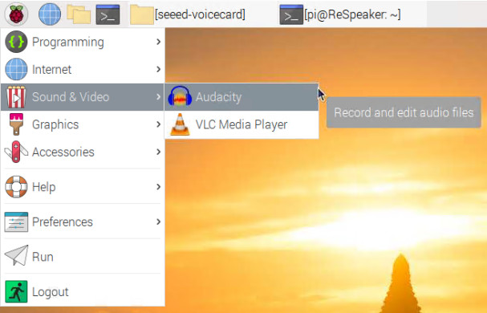
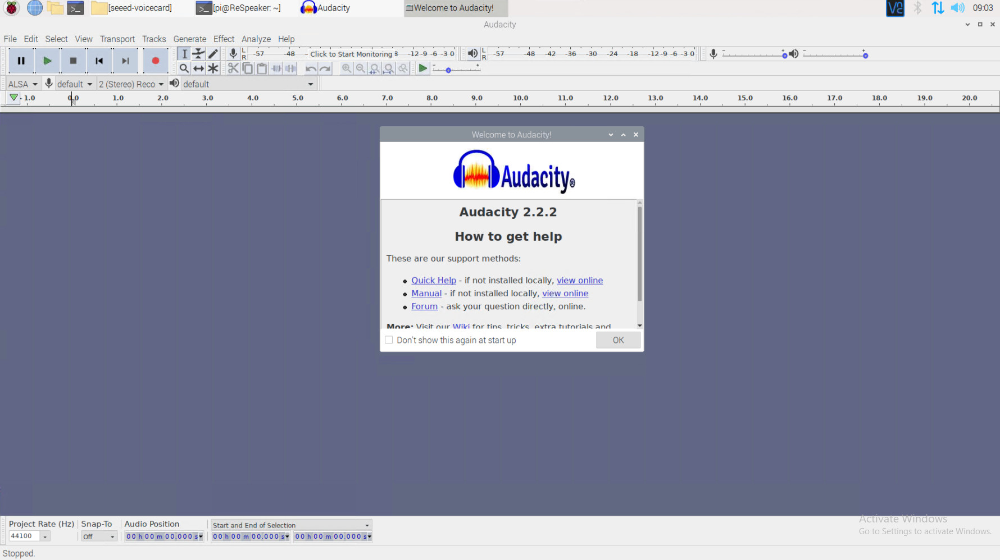
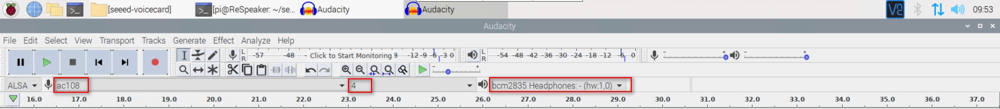
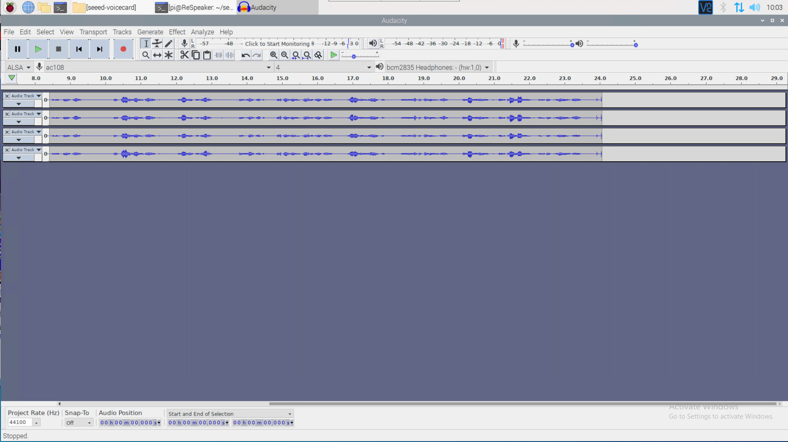
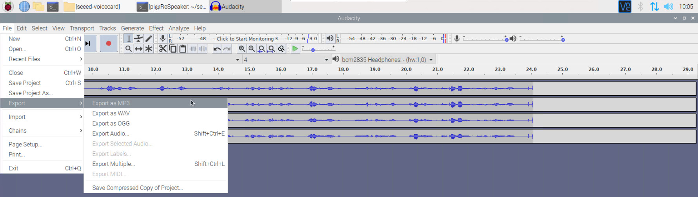
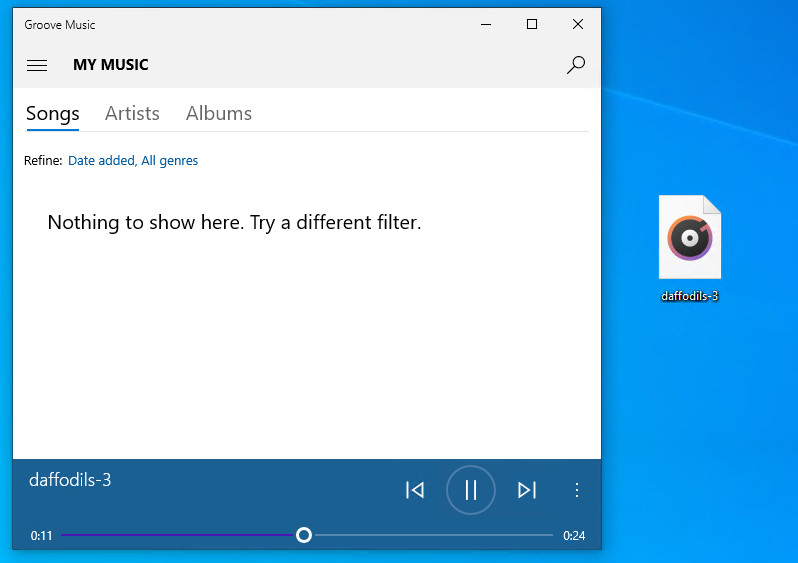

# Lab 2: Record audio with Audacity

## 1. Prerequisites:

- Raspberry Pi 3B/4B, 1GB+ RAM, 16GB+ SD card
- ReSpeaker 4-Mic Array
- Lab 1 is completed.

---

## 2. Install Audacity on RPi

Run below commands to install the `Audacity` app.

```
sudo apt update
sudo apt install audacity
```


---

## 3. Run Audacity app

Run Audacity app from bash or from GUI:

- Run below command from Bash:
```
audacity
```

- Run from GUI:

`Raspberry Pi logo` -> `Sound & Video` -> `Audacity`.



The Audacity app UI is like this:



---

## 4. Record an audio

Select or `ac108` and `4` channels as audio input and `bcm2835 Headphones-(hw:1,0)` as audio output.



Click `Record button` to start the recording. Try to say something here.

In my case, I chose to read William Wordsworth's `Daffodils`.



---

## 5. Export the recorded audio to a .mp3 file

Click `File` -> `Export` -> `Export as MP3`.




This exported `daffodils-3.mp3` file can be played anywhere like Windows.



`<END of Lab2>`


