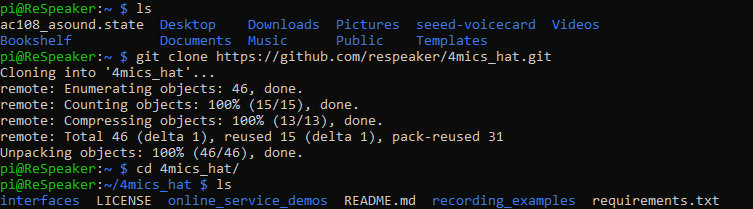
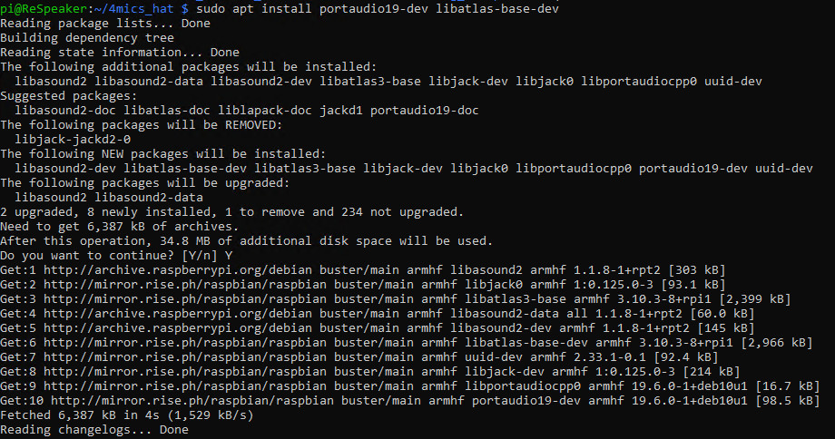
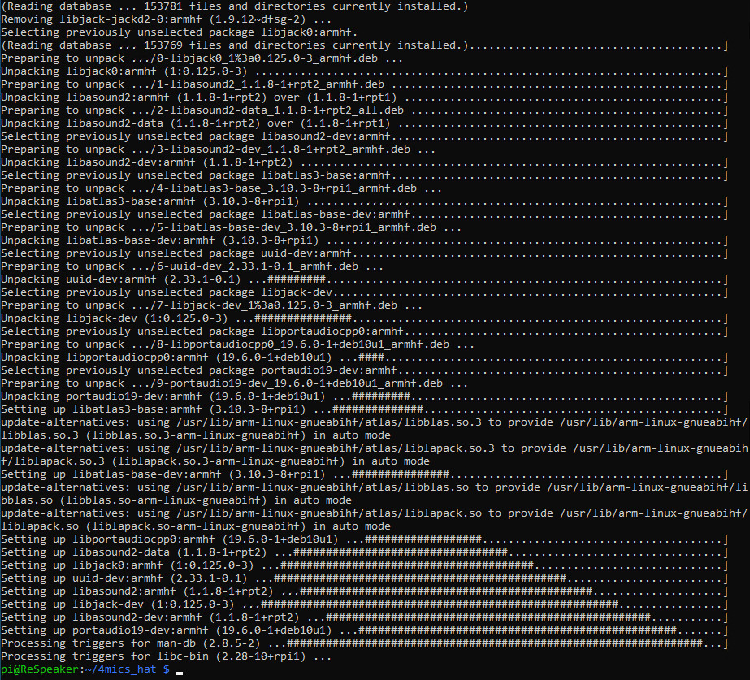
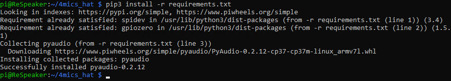
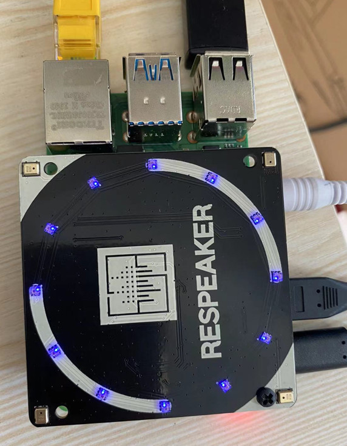
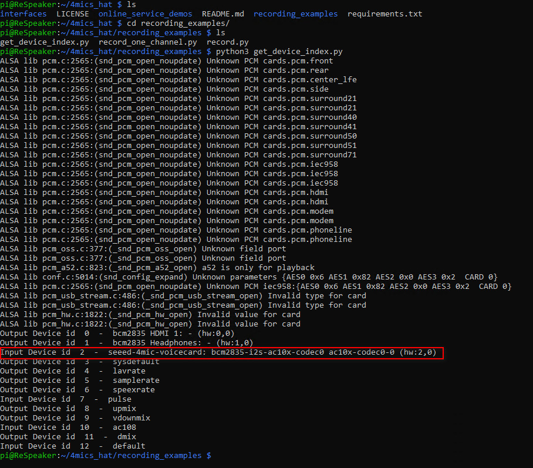
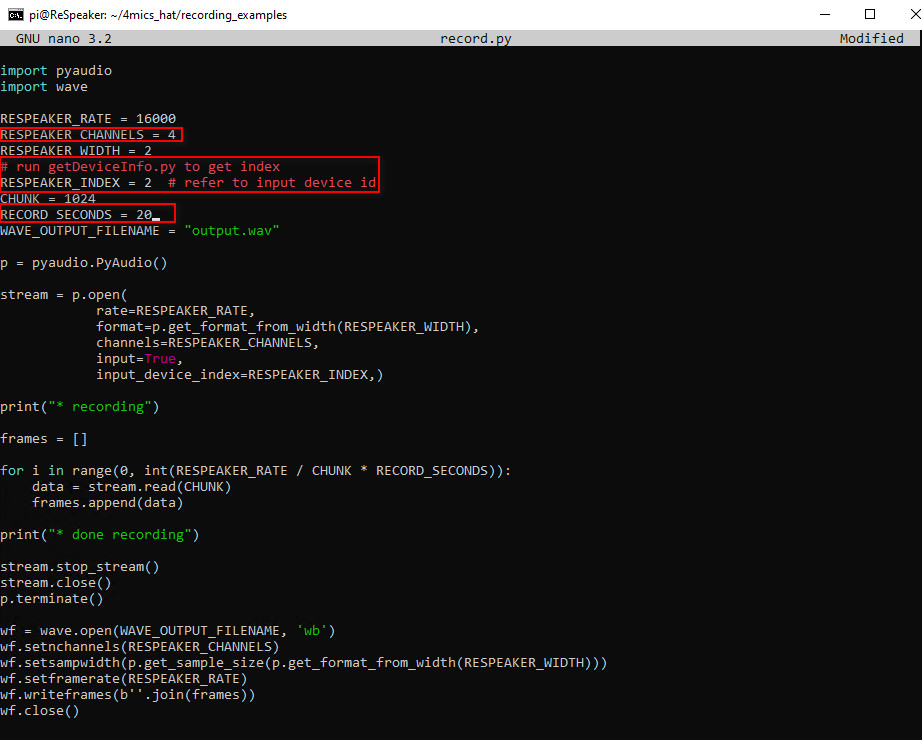
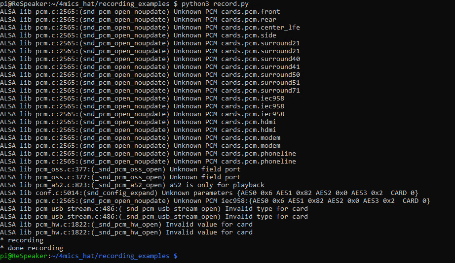
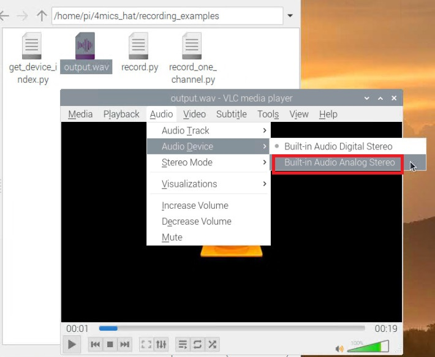

# Lab 3: Record Sound with Python

## 1. Prerequisites:

- Raspberry Pi 3B/4B, 1GB+ RAM, 16GB+ SD card
- ReSpeaker 4-Mic Array
- Lab 1 is completed.

---

## 2. Download the 4mics_hat repo

Run below commands to clone the repo.

```
git clone https://github.com/respeaker/4mics_hat.git
```



---

## 3. Install necessary dependencies

Below software/libs are required:
- `PortAudio`
- `libatlas-base-dev`
- `spidev`
- `gpiozero`

`PortAudio` is a portable audio I/O library designed for cross-platform support of audio. It uses either a callback mechanism to request audio processing, or blocking read/write calls to buffer data between the native audio subsystem and the client. Audio can be processed in various formats, including 32 bit floating point, and will be converted to the native format internally. For more details, you may refer to [here](https://github.com/PortAudio/portaudio).

`libatlas-base-dev` refers to `Automatically Tuned Linear Algebra Software`. Generic static ATLAS is an approach for the automatic generation and optimization of numerical software.

`spidev` contains a python module for interfacing with `SPI` devices from user space via the `spidev linux kernel driver`. For more details, you may refer to [here](https://github.com/doceme/py-spidev).  

`gpiozero` builds on a number of `underlying pin libraries`, including `RPi.GPIO` and `pigpio`, each with their own benefits. You can select a particular pin library to be used, either for the whole script or per-device, according to your needs. For more details, you may refer to [here](https://github.com/gpiozero/gpiozero).


In the `4mics_hat` directory, run below commands.

```
sudo apt install portaudio19-dev libatlas-base-dev
pip3 install -r requirements.txt
```







---


## 4. Enable APA102 LEDs

As you may see, there are 12 LEDs on top of the ReSpeaker 4Mic Array. These LEDs are called `APA102` LEDs.

Each on-board APA102 LED has an additional `driver chip`. The driver chip takes care of `receiving` the desired colour via its input lines and then `holding` this colour until a new command is received.

### 4.1 Enable SPI on RPi4

You may use `raspi-config` tool to activate SPI on RPi4 if you haven't done so. 

### 4.2 Run the LED test sample

Go to `~/4mics_hat/interfaces`, run `pixels.py`.

```
cd ~/4mics_hat/interfaces
python3 pixels.py
```

The running result is as below.



You may open `pixels.py` to study the codes or modify the codes per your needs.

## 5. Record sound with Python

Here we use `PyAudio libary` to record the sound.

### 5.1 Get the device index number

The device index number for `4mic pi hat` is `2.

You may also run below script to get the device index number of `4mic pi hat`.

```
python3 ~/4mics_hat/recording_examples/get_device_index.py
```



### 5.2 Start a recording

Open `~/4mics_hat/recording_examples/record.py`, modify below two values:
```
RESPEAKER_CHANNELS = 4
RESPEAKER_INDEX = 2  # refer to input device id
RECORD_SECONDS = 20
```



Once the code is running, try to speak something. The app will stop recording in 20 seconds.



---

The recorded audio is saved as `output.wav` in the same directory. 

### 5.3 Play the recorded sound

You may use the `Audacity` app installed in Lab 2 or the `VLC media player` pre-installed in the Raspian OS.

Here I will use `VLC media player` to play the recorded sample.

Go to `~/4mics_hat/recording_examples`, double click `output.wav` and the VLC media player will run. 

You may notice the audio is playing, but you don't hear the sound from your headphone. In this case, you may need to go to `VLC media player` -> `Audio` -> `Audo Device` -> Switch to `Built-in Audio Analog Stereo`. By default, it is `Built-in Audio Digital Stereo`.



Now you should be able to hear the sound.


`<END of Lab3>`


