# Lab 4: Real-time Sound Source Localization and Tracking


## 1. Prerequisites:

- Raspberry Pi 3B/4B, 1GB+ RAM, 16GB+ SD card
- ReSpeaker 4-Mic Array
- Lab 1 is completed.
- **Development PC running Ubuntu 18.04 LTS - AMD64 **
  - ODAS Studio may not work on Ubuntu 20.04 or later.

---

## 2. Download and install ODAS

`ODAS` stands for `Open embeddeD Audition System`. This is a library dedicated to performing `sound source localization`, `tracking`, `separation` and `post-filtering`.

For more details, you may refer to [here](https://github.com/introlab/odas).


### 2.1 Install ODAS dependencies

I will install ODAS and ODAS Studio on a development PC running `Ubuntu 18.04 LTS` on AMD64 platform.

Below are dependencies for ODAS:
- FFTW
- LibConfig
- ALSA
- PulseAudio

Run below script to install the dependencies:

```
sudo apt update
sudo apt install -y libfftw3-dev libconfig-dev libasound2-dev libgconf-2-4 libpulse-dev
```

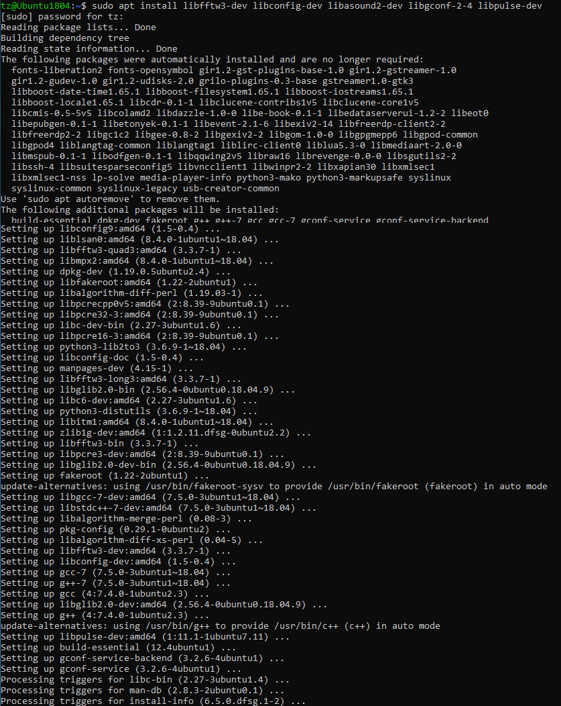

### 2.2 Install compiling tools

```

sudo apt install -y gcc g++ cmake make
```
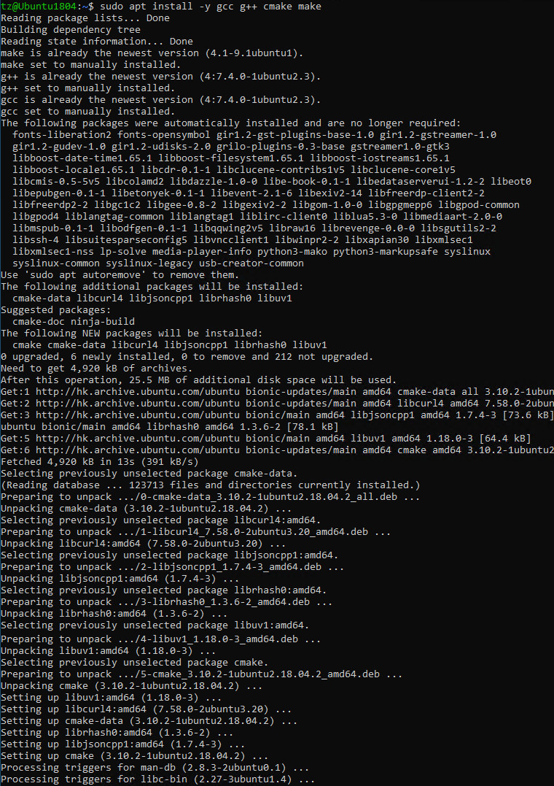

### 2.3 Clone the ODAS repo and build the project

#### 2.3.1  Clone the project
```
cd ~
git clone https://github.com/introlab/odas.git
```
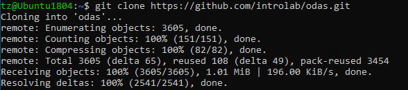


#### 2.3.2 Create a folder to build the project

```
mkdir odas/build
cd odas/build
```

##### 2.3.3 Run CMake

```
cmake ..
```

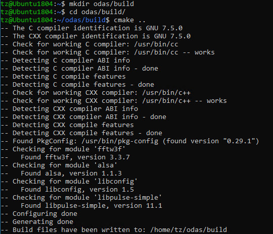


#### 2.3.4 Compile the project

```
make
```

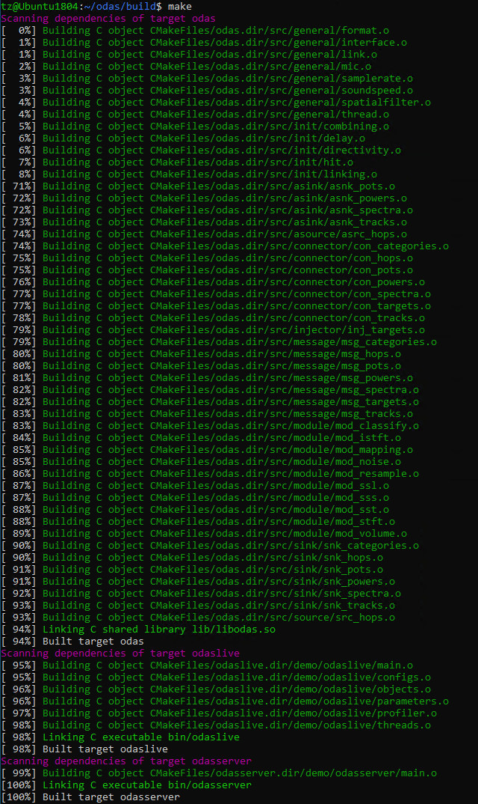

---

## 3. Download ODAS Studio and install

ODAS Studio is a desktop interface built to visually represents data produced by the ODAS algorithm and manage recordings of separated audio sources. ODAS Studio represents audio energy and tracked audio sources on an unit sphere and is a powerful tool when tuning ODAS settings. ODAS Studio also records separated audio as distinct wav files. ODAS Studio is built on the Electron framework and can be run natively on PC, Mac and Linux.

Please be noted ODAS Studio is `not supported` on Raspberry Pi due to CPU limitation.

### 3.1 Install npm

```
sudo apt update
sudo apt -y install curl dirmngr apt-transport-https lsb-release ca-certificates
curl -sL https://deb.nodesource.com/setup_12.x | sudo -E bash -
```

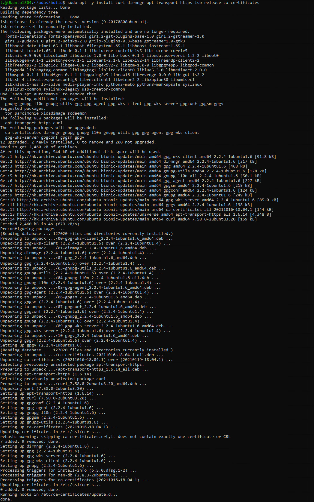

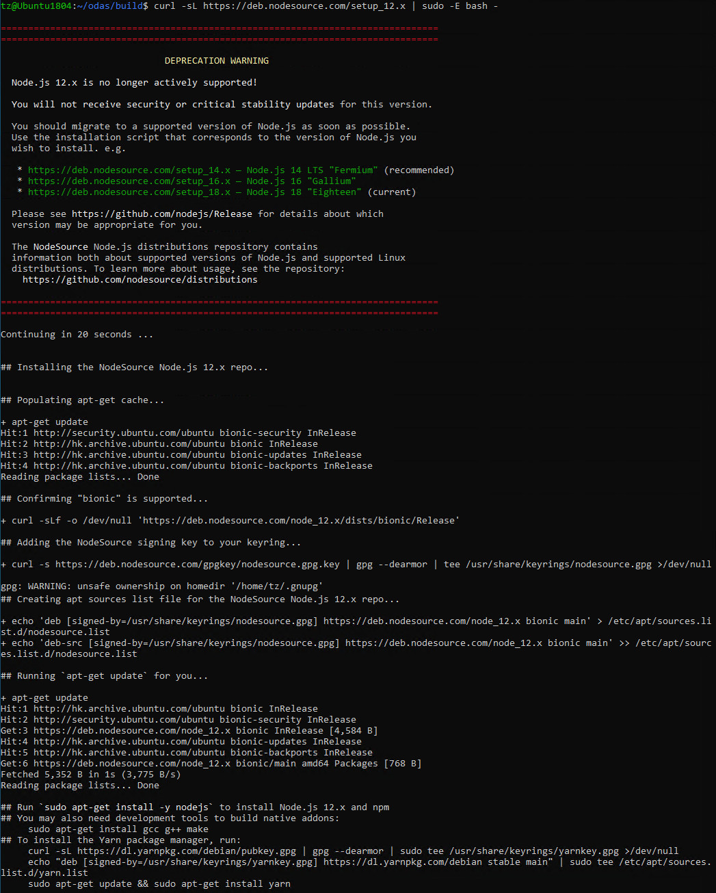


### 3.2 Install nodejs

Ensure below tools are installed

```
sudo apt update
sudo apt install -y nodejs 
```

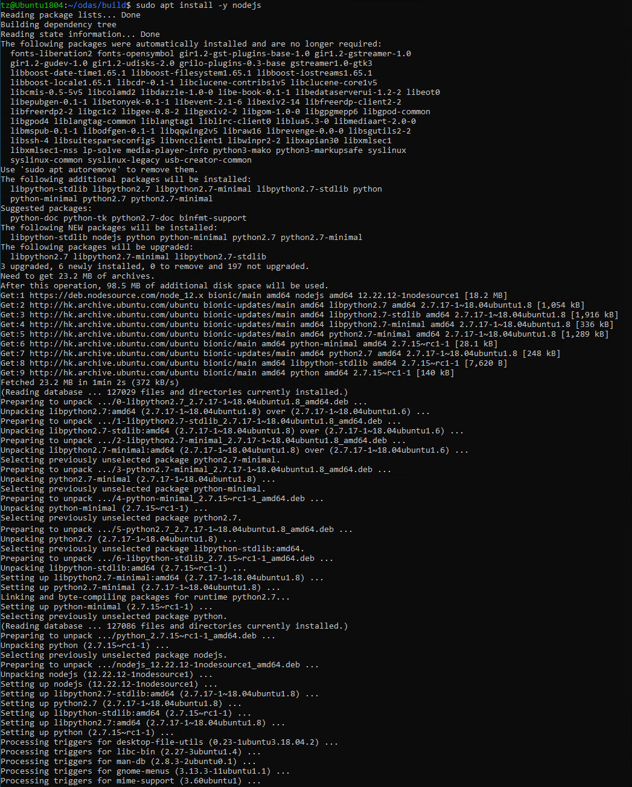

### 3.3 Install odas_web with npm

```
cd ~
git clone https://github.com/introlab/odas_web
cd odas_web
npm install
```

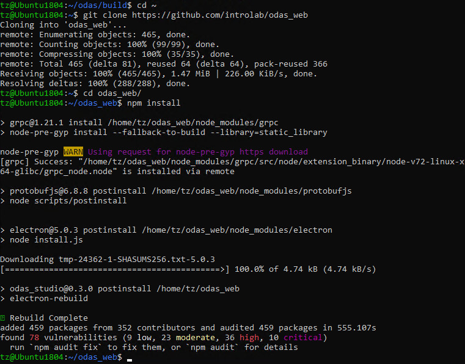


---

## 4. Run ODAS Studio

```
npm start
```

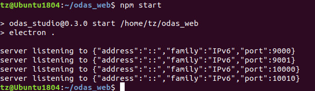

I'm using a Ubuntu1804 VM and may notice the right side of ODAS Studio UI keeps flashing visibly. Running the app in full screen mode will resolve the problem by pressing key `F11` to toggle Full Screen mode. Press `F11` key again to exit the full screen mode.

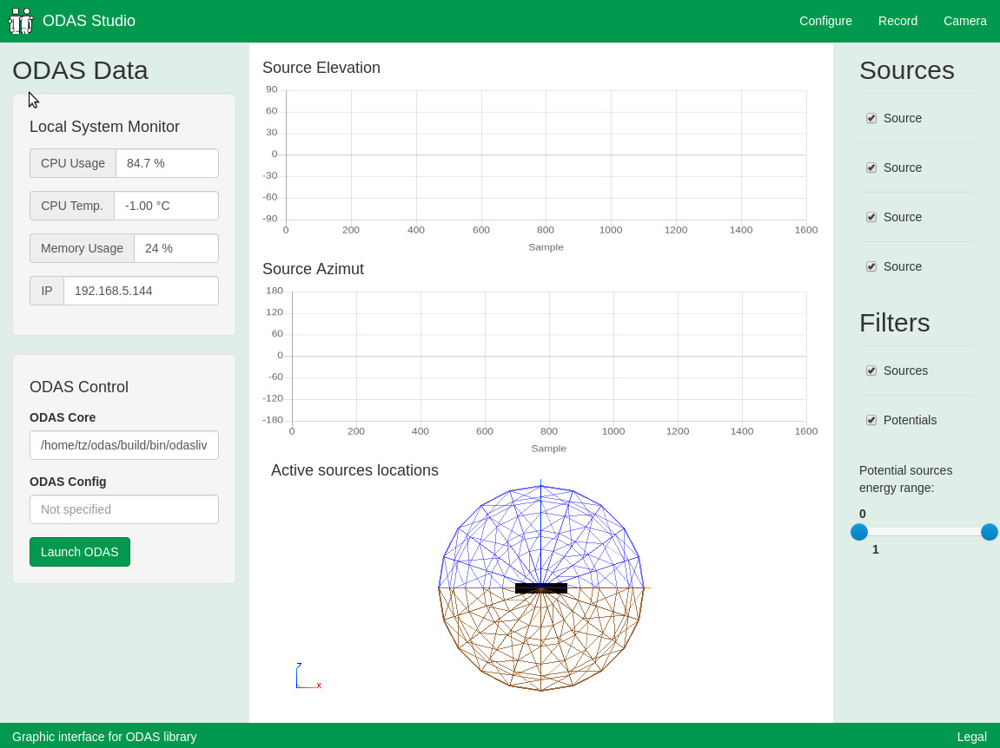


`<END of Lab4>`


