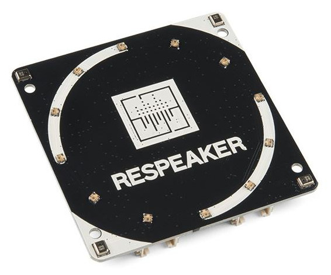

# Readme

This series of labs provide a quick starter guide on developing ReSpeaker with Raspberry Pi.

## ReSpeaker 4 Mic Array for Raspberry Pi 

ReSpeaker 4-Mic Array for Raspberry Pi is a quad-microphone expansion board for Raspberry Pi designed for AI and voice applications. This means that we can build a more powerful and flexible voice product that integrates Amazon Alexa Voice Service, Google Assistant, and so on.

This board is developed based on AC108, a highly integrated quad-channel ADC with I2S/TDM output transition for high definition voice capture, which allows the device to pick up sounds in a 3 meters radius. Additionally, this 4-Mics version features an LED ring with 12 APA102 programable LEDs. With that 4 microphones and the LED ring, Raspberry Pi would have the ability to do VAD(Voice Activity Detection), estimate DOA(Direction of Arrival), do KWS(Keyword Search) and show the direction via LED ring, just like Amazon Echo or Google Home.

## ReSpeaker Interface

- MIC: 4 analog microphones
- LED: 12 APA102 programable RGB LEDs, connected to SPI interface
- Raspberry Pi 40-Pin Headers: compatible with RPi2/3/4
- AC108: highly integrated quad-channel ADC with I2S/TDM output transition
- I2C: Grove I2C port, connected to I2C-1
- GPIO12: Grove digital port, connected to GPIO12 & GPIO13

## ReSpeaker Features

- Raspberry Pi compatible
- 4 Microphones
- 3 meters radius voice capture
- 2 Grove Interfaces
- 12 APA102 User LEDs
- Software Algorithms: 
  - **VAD** (Voice Activity Detection) 
  - **DOA** (Direction Of Arrival)
  - **KWS** (KeyWord Search)
	
Note: There is no audio output interface on ReSpeaker 4-Mic Array for Raspberry Pi. It is only for voice capture. We can use the headphone jack on Raspberry Pi for audio output.

# Labs Index

This series of labs provides 5 Labs to play with ReSpeaker 4-MiC Array.

### [Lab 1: Install OS and driver](Lab1-Install_OS_and_Driver.md)
### [Lab 2: Record audio with Audacity](Lab2-Record_Audio_with_Audacity.md)
### [Lab 3: Record sound with Python](Lab3-Record_Sound_with_Python.md)
### [Lab 4: Real-time sound source localization and tracking](Lab4-Sound_Source_Localization_and_Tracking.md)

`<END of Readme>`
